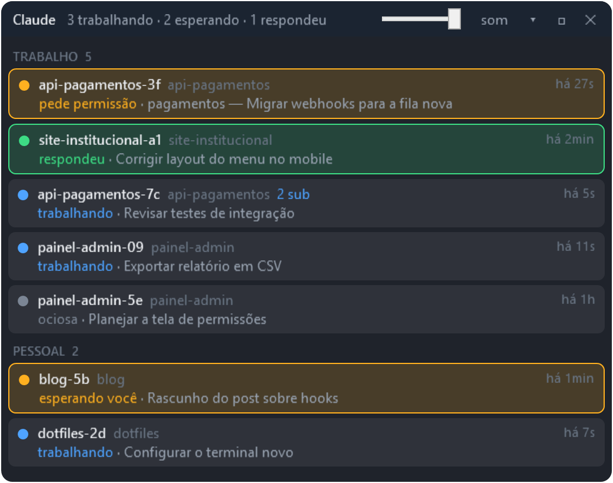
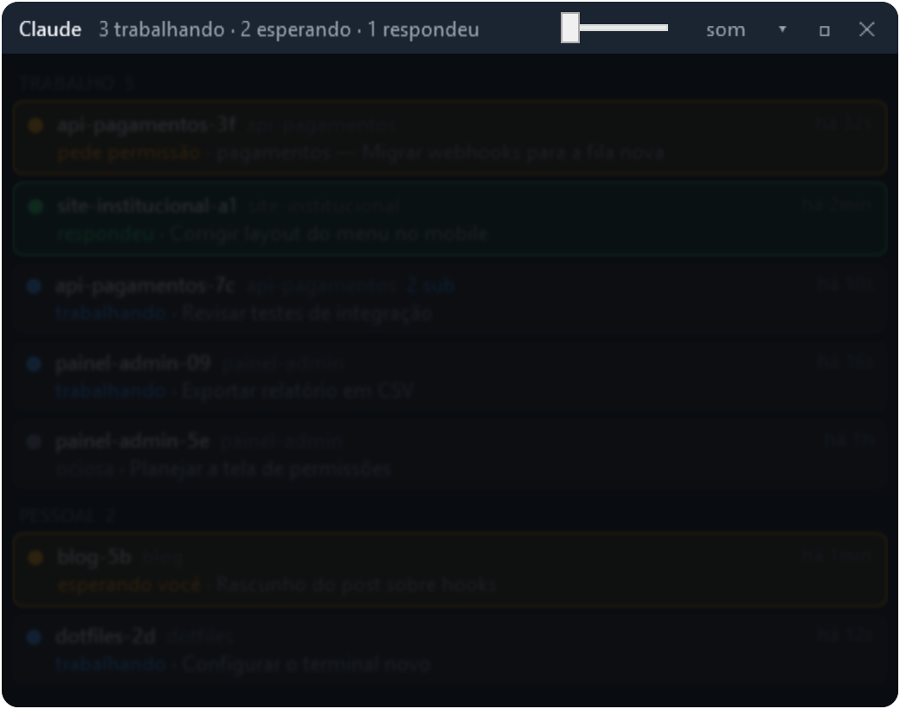
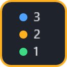

<p align="center">
  
</p>

<h1 align="center">Claude Overlay</h1>

<p align="center">
  All your Claude Code sessions in a small always-on-top window on Windows.<br>
  Multiple accounts together, live status, and a heads-up when one of them needs you.
</p>

<p align="center">
  <a href="https://github.com/EoBryann/claude-overlay/actions/workflows/ci.yml"></a>
  <a href="https://github.com/EoBryann/claude-overlay/releases/latest"></a>
  
  <a href="LICENSE"></a>
</p>

<p align="center">
  <a href="README.md">Português</a> · <b>English</b>
</p>

<p align="center">
  
</p>

> [!NOTE]
> The interface is in Portuguese for now. Here is what each status means:
> **trabalhando** = working, **pede permissão** = asking for permission, **esperando você** = waiting for you, **respondeu** = answered, **ociosa** = idle, **sem sinal** = no signal yet.
> Translations are welcome; see [CONTRIBUTING.md](CONTRIBUTING.md).

## Why

If you keep several Claude Code sessions open at once (terminal, VS Code, Cursor, a work account and a personal one), it is easy to leave one sitting there asking for permission while you look at another. Claude Overlay puts all of them in a small window that stays on top of everything else and tells you when one answers or needs you.

## Features

- **Every session in one place:** CLI and VS Code/Cursor extensions, grouped by profile.
- **Several accounts at once:** each `CLAUDE_CONFIG_DIR` becomes a group in the same window.
- **Live status:** working, asking for permission, waiting for you, answered, idle.
- **Chat name** for each session (the name you gave it or the automatic title), plus the folder, active subagents and how long ago the last event was.
- **Windows notifications** when a session answers or asks for permission.
- **Mini mode:** shrinks to three counters, and the border lights up when there is something you have not seen.
- **Privacy dimmer:** darkens and blurs the list so nobody can read it over your shoulder.
- **Lightweight:** no npm dependencies, no background service, and it never invokes the Claude binary. Hooks run asynchronously, so they do not slow sessions down.

<table>
  <tr>
    <td align="center"><br><sub>Privacy: the list darkens and blurs</sub></td>
    <td align="center"><br><sub>Mini mode</sub></td>
  </tr>
</table>

## Requirements

- Windows 10 or 11 with Windows PowerShell 5.1 (ships with Windows).
- [Node.js](https://nodejs.org) 20 or newer.
- A recent Claude Code with support for `command` + `args` hooks (tested on 2.1.280).

## Install

```powershell
git clone https://github.com/EoBryann/claude-overlay.git
cd claude-overlay
node instalar.js
```

Then open it from the **Claude Overlay** shortcut on your desktop.

The installer:
1. Finds your Claude Code config folders (`~/.claude`, `~/.claude-*` and `CLAUDE_CONFIG_DIR`) and writes them to `config.json`.
2. Adds the overlay hooks to each profile's `settings.json`. It backs the file up to `<profile>/backups-manual/` first and keeps any hooks you already had.
3. Creates the desktop shortcut. With `--iniciar-com-windows`, it also opens the overlay at logon.

> [!NOTE]
> Sessions that were already open show "sem sinal" (no signal) until their next event. Run `/hooks` in them if they do not update.
> The hooks point to the folder you cloned into, so run `node instalar.js` again if you move it.

To update, run `git pull` in the folder, then close and reopen the window.

## Configuration

Everything lives in `config.json`. It is created on the first install and ignored by git; see [config.exemplo.json](config.exemplo.json):

```json
{
  "perfis": [
    { "nome": "Work",     "id": "work",     "pasta": "~/.claude-work" },
    { "nome": "Personal", "id": "personal", "pasta": "~/.claude" }
  ]
}
```

| Field | Meaning |
|---|---|
| `pasta` | The profile's `CLAUDE_CONFIG_DIR`. Accepts `~` and variables such as `%USERPROFILE%`. |
| `nome` | Group header shown in the window. |
| `id` | Identifies the profile in the hook and in `state/`. Defaults to a slug of `nome`. |

- The list order is the group order in the window.
- After adding a profile, run `node instalar.js` again to install its hooks. The window reloads `config.json` on its own.
- With a single account you do not need a config at all: without one, the overlay shows the default profile (`CLAUDE_CONFIG_DIR` or `~/.claude`).

## Usage

| Action | How |
|---|---|
| Move / resize | Drag the title bar / the bottom-right corner |
| Mark as seen | Click a highlighted row |
| Full folder and last answer | Hover over the row |
| Summary bar only | Double-click the title bar or the **▾** button |
| Mini mode | **□** button; drag to move, click to restore |
| Privacy dimmer | Slider on the title bar, or scroll the mouse wheel over it |
| Mute notifications | **som** button |

## Uninstall

```powershell
node instalar.js --remover
```

This removes the hooks from every profile in `config.json` and the shortcuts that point to this folder. Then delete the folder.

## How it works

- **`hook.js`** runs on `SessionStart`, `UserPromptSubmit`, `PreToolUse`, `SubagentStart`/`SubagentStop`, `Notification`, `Stop` and `SessionEnd`, and writes `state/<profile>/<session>.json`. It never writes to stdout and runs with `async: true`.
- **`overlay.ps1`** (WPF) merges that state with the `sessions/<pid>.json` records that Claude Code itself keeps, every 1.5 s. It only shows sessions whose process is alive.
- **The chat name** comes from the tail of the transcript (`customTitle` or `aiTitle`). The file is opened in shared mode, so it never blocks Claude.

## Troubleshooting

- `powershell -File overlay.ps1 -Diagnostico` prints what the window sees.
- `powershell -File overlay.ps1 -TestarToast` sends a test notification.
- `node instalar.js --detectar` shows which profiles would be detected, without writing anything.
- Errors go to `overlay.log` (window) and `hook.log` (hooks), in the overlay folder.

## Contributing

PRs are welcome! See [CONTRIBUTING.md](CONTRIBUTING.md) (in Portuguese) for the branch flow (`develop` → `main`), the tests and the code rules.

## License

[MIT](LICENSE) © Bryan Porto

<sub>Independent community project, not affiliated with Anthropic. "Claude" and "Claude Code" are trademarks of Anthropic.</sub>
